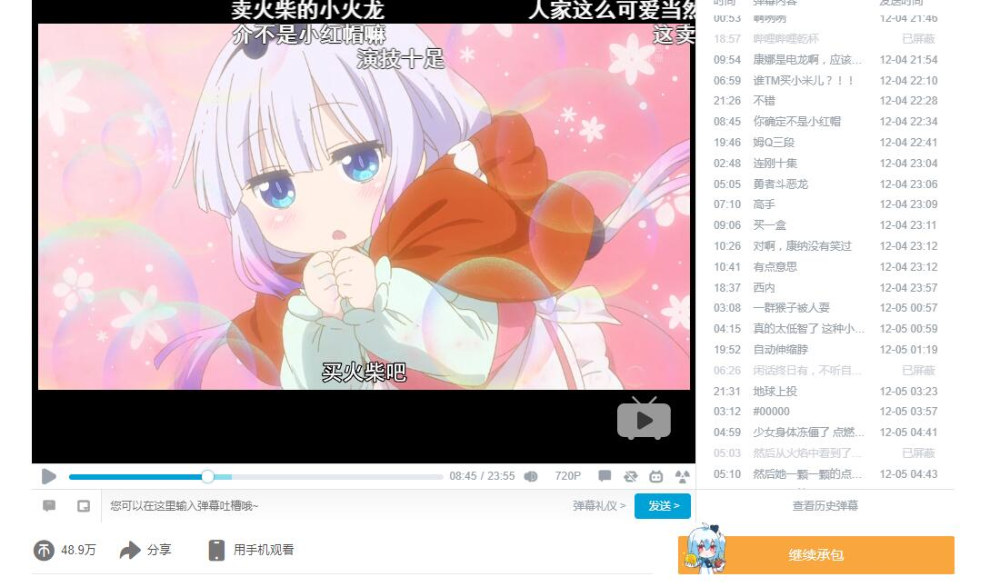

Bilibili替换旧版播放器
=========================

[个人脚本仓库](https://github.com/indefined/UserScripts)

-------------------------
## [替换版](./bilibiliOldReplacePlayer.user.js)

- 通过替换脚本的方式执行。

思路来自[这里](https://greasyfork.org/zh-CN/forum/discussion/68269/0/)

本文件夹下脚本仅为试验尝试，应该也不维护了，有需要的可以尝试一下原思路作者的脚本 [Bilibili 旧播放页](https://greasyfork.org/zh-CN/scripts/394296-bilibili-%E6%97%A7%E6%92%AD%E6%94%BE%E9%A1%B5
) 写得应该挺完善的

### 已知问题

1. 播放器加载过程中播放器的位置是空的
2. 稍后再看页无法显示列表
3. 与其它几乎所有脚本互斥

-------------------------
## [嵌入版](./bilibiliOldEmbedPlayer.user.js)

- 很无聊地把B站的播放器炸掉然后内嵌一个站外的旧版播放器下去

### 已知问题

1. 所有会员、付费、港澳台视频不能播放，虽然脚本已经简单判断过不在会员视频启动但是仍然可能有误判情况。
  - 如有不能播放视频自行关掉脚本，不会对特定视频做单独适配
2. 专题页面、部分番剧和电影、收藏夹播放列表无法使用
3. 需要关掉Mini播放器，否则网页滚动时会卡到你怀疑人生甚至死机
4. 换P会刷新页面
5. 互动视频会失去互动
6. 与其它几乎所有脚本互斥

-------------------------
## 兼容性

- 未知，不保证兼容性，没有打算发布，大概并不会有什么后续更新
